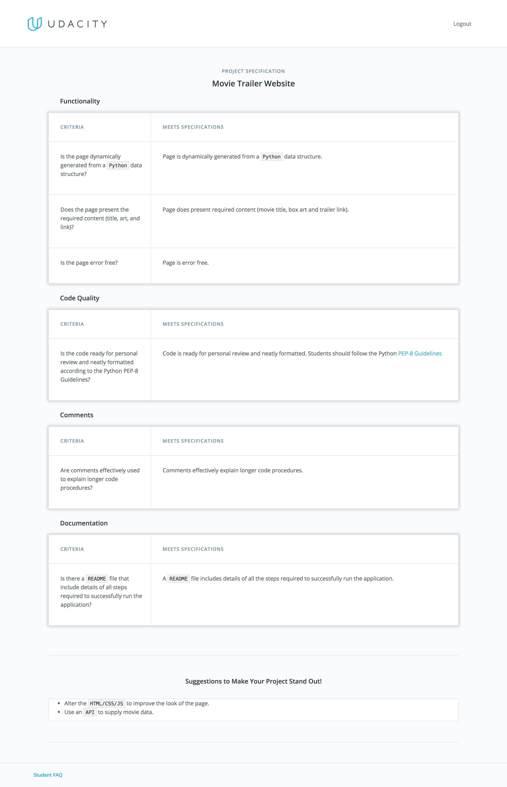

# Project Submission
You will write server-side code to store a list of your favorite movies, including box art imagery and a movie trailer URL. You will then serve this data as a web page allowing visitors to review their movies and watch the trailers.

# Evaluation
Your project will be evaluated by a Udacity Code Reviewer according to the rubric below. Be sure to review it thoroughly before you submit. All criteria must "meet specifications" in order to pass. Furthermore a code reviewer has posted [their pre-submission checklist](https://discussions.udacity.com/t/project-1-checklist-read-this-before-you-submit-your-project/39852) on the forums, refer to it for even more detail on what reviewers look for in a project.

# Submission
When you're ready to submit your project, click [here](https://review.udacity.com/#!/rubrics/1775/start) and follow the instructions. Due to the high volume of submissions we receive, please allow up to **7 business days** for your evaluation to be returned.

If you are having any problems submitting your project or wish to check up on the status of your evaluation, please email us at **fullstack-project@udacity.com**.

# Next Steps
You will get an email as soon as your reviewer has feedback for you. In the meantime, review your next project and feel free to get started on it or the courses supporting it!
